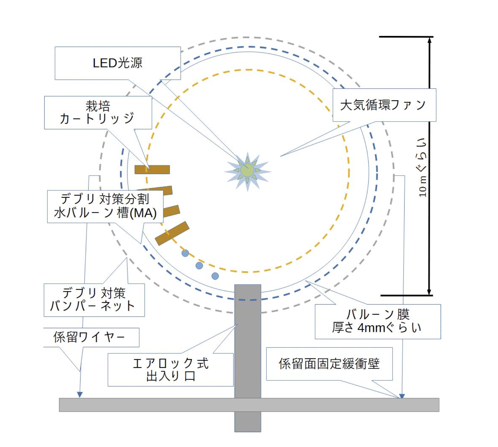
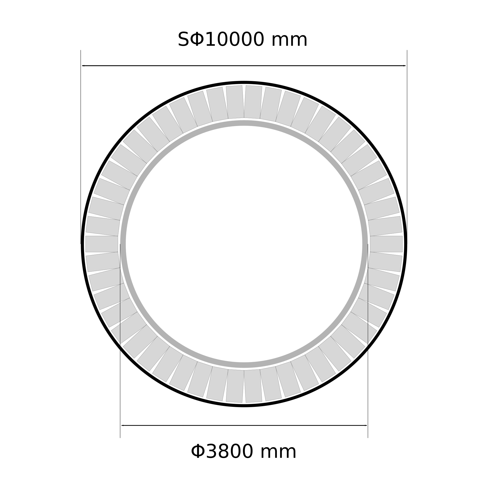
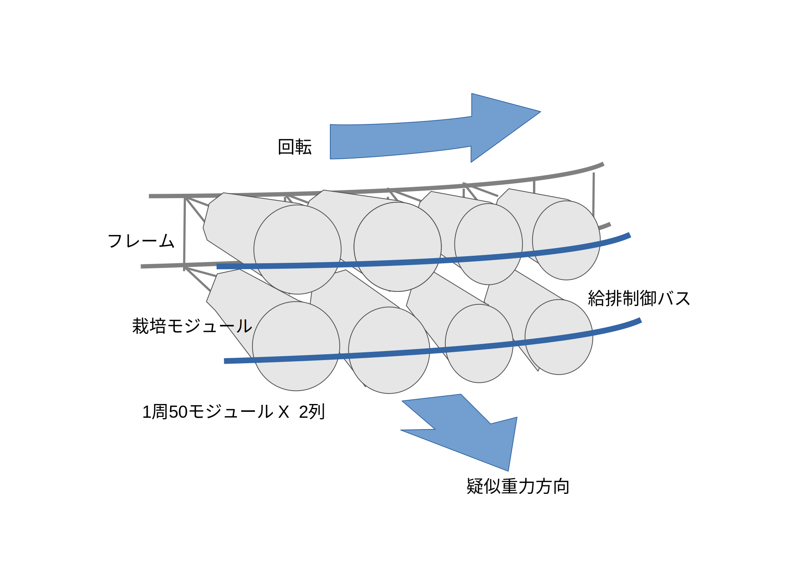

# 要旨
宇宙農場における重力について調査し、バルーン形状の植物栽培プラントに対する人工重力の影響を主に材料力学の観点から計算した。

# はじめに
生物は常に重力を受ける環境で進化してきた。
人間も例外でなく、宇宙空間のような微小重力環境では様々な弊害が起こることが知られている。
現状での主な対応方法は運動をすることであるが、宇宙飛行士の貴重な活動時間が犠牲になっている。

また、アルテミス計画の一部である月面基地建設、そこからの火星探査を実現するためには、地球からの輸送に頼らない宇宙での自給自足体制の確立が必要不可欠である。
採算を考慮した現実的な方法として、野菜を中心とした植物の宇宙農場の建設が考えられる。
先行研究として、バルーン形状の植物栽培プラント「メタルネットバルーンプラント」(以下、MNBP) \[1\] があり、この装置をベースにして本記事を展開していく。

今回は、植物栽培に致命的な影響を与えない重力の大きさを考察し、同程度の人工重力を回転によって MNBP に与えた際に、強度に問題がないかを計算によって確認する。

# 植物栽培における重力の大きさ
Manzano ら \[2\] は、低重力可変型 3D クリノスタットを開発し、模擬低重力環境応答について解析した。
彼らは、地上 1g、 疑似微小重力(µg)、および、0.17g と 0.38g（月や火星表面の重力を模擬している）を作り出し、シロイヌナズナの根の成長に及ぼす影響について報告している。
結果として、根の細胞は 1g 環境と比較して、0.17g では、µg と同様に細胞の増殖速度は速くなるが、細胞の大きさは小さくなることを報告している。なお、0.38g 環境では、根の細胞の増殖速度、大きさは 1g 環境と比較して有意差は認められなかった。

[]( scale=0.1 )
**出典： \[2\]**

上記より、0.38g では植物の成長に致命的な影響はないと仮定して以降の議論を進める。

# MNBP について
MNBP は前述したとおり、バルーン形状の植物栽培プラントである。
初期構想の図を以下に引用する。

[]( scale=0.2 )
**図 MNBP の構造（初期構想）**

\[1\] にて、すでに MNBP の諸元の方針が決められているので引用する。

**表 MNBP諸元 （バルーンの素材に和紙＋こんにゃくを用いた場合）**
|バルーン直径 $\text{[m]}$|バルーン表面積 $\text{[m}^3\text{]}$|バルーン厚さ $\text{[m]}$|比重  |バルーン重量 $\text{[t]}$|材質          |破断強度 $\text{[MPa]}$|気圧 $\text{[atm]}$|圧力 $\text{[Pa]}$|応力 $\text{[MPa]}$|
|----:                  |----:                             |----:                  |----:|----:                  |:----        |----:                 |----:             |----:             |----:             |
|10                     |314                               |0.0018                 |1.3  |0.7                    |和紙＋こんにゃく|525                   |0.1               |10133             |417               |

本記事での説明は以上とする。詳細は、\[1\] を参照されたい。

# 人工重力を発生させる回転が MNBP に与える影響について
MNBP は人工重力を発生させるために回転することを考慮した設計になっていないため、構造の見直しとその影響を具体的な数値で検討していく。

## 栽培モジュール支持フレームの追加
現状、植物栽培モジュールはバルーンに直接接続する構造となっているが、バルーンの材質選定時には回転することを想定していない。
そこで、バルーンの内側にフレームを設けてそこにモジュールを接続する構造を考える。

半径3.8メートル、厚さ10ミリメートルのパイプをスライスしてフレームとしたい（バルーンの半径は5メートル）。
植物栽培モジュールの高さを1メートルとし、フレームの外側にクリアランスを10センチメートル設けて接続する。
植物栽培モジュールは1つあたり3kgとし、1つのバルーンに対して100個とりつけることとする。
植物栽培モジュールの中心に重心があると仮定し、そこに 0.38g 相当の遠心力がかかるよう回転させて強度に問題がないか確認する。
強度の確認のために周方向の応力が必要になるため、周方向のフープ応力を求めることにする。\[3\]

[]( scale=0.3 )

[]( scale=0.3 )

まずは、ナイロン製のフレームの強度を確認する。

$$
\begin{align}
m \Coloneqq & \text{すべてのモジュールの重さの合計} = 3\ \text{[kg]} * 100 = 300\ \text{[kg]} \\
r \Coloneqq & \text{植物モジュールの重心のバルーン中心からの距離} \\
  = & \text{フレームの半径 + クリアランス + (植物モジュールの高さ / 2)} \\
  = & 3.8 + 0.1 + (1/2) = 4.4\ \text{[m]} \\
\\
\sigma \Coloneqq & \text{周方向のフープ応力 [MPa]} = (PD)/(2t) \\
t \Coloneqq & \text{厚み} = 10\ \text{[mm]} = 0.01\ \text{[m]} \\
D \Coloneqq & \text{内径} = 2 \times 3.8 - 2t = 7600 - 20 = 7580 \ \text{[mm]} = 7.58\ \text{[m]} \\
P \Coloneqq & \text{フレーム全体（360°）にかかる荷重} = \text{フープ応力における内圧 [MPa]} \\
\end{align}
$$

まずは、内圧を求める。

$$
\begin{align}
& ma = mrω^2 \\
& a = rω^2 \\
& 0.38g = 4.4 ω^2 \\
& ω^2 = (0.38g) / 4.4 \\
\end{align}
$$

$$
\begin{align}
F & = ma = mrω^2 = 300 \times 4.4 \times (0.38g / 4.4) = 300 \times 0.38g = 114g \\
  & = 114 \times 9.80665 = 1117.9581\ \text{[N]}
\end{align}
$$

ここで、パイプの幅 $L$ を仮に $1\ \text{[m]}$ とすると、

$$
\begin{align}
& \text{パイプ内側の面積} = D \pi L = 7.58 \times \pi \times 1 = 7.58 \pi \ \text{[m$^2$]} \\
& P = 1117.9581 / (7.58 \pi) = 46.9468490196896... \simeq 46.95\ \text{[Pa]}
\end{align}
$$

内圧が求められたので、周方向のフープ応力を計算する。

$$
\begin{align}
\sigma & = (PD)/(2t) = (46.95 \times 10^{-6} \times 7580) / (2 \times 10) \\
& = 0.01779405 \\
& \simeq 0.0178\ \text{[MPa]}
\end{align}
$$

ナイロンの引張強度は、 $41\text{-}166 \ \text{[MPa]}$ \[4\] の範囲なので、ここでは $100 \ \text{[MPa]}$ とすると、
$100 / 0.0178 = 5617.97752808989... \simeq 5600 \ \text{倍}$ の強度の余裕がある。
ナイロンの比重は、 $1.12\text{-}1.14$ なので $1.13$ として、必要な強度を満たすフレームの質量を計算すると、

$$
\begin{align}
& \big( (3.8^2 - 3.79^2) \times \pi \times 1 \times 1.13 \big) / 5600 \\
\quad & = 0.000048115174... \ \text{[t]} \\
\quad & \simeq 0.04812 \ \text{[kg]} \\
\quad & \simeq 48.1 \ \text{[g]}
\end{align}
$$

となる。

ナイロンでは剛性が足りない可能性があるので、鋼鉄（S45C）をフレーム素材とした場合の質量も計算する。
S45C の引張強度を $690$ , 比重を $7.85$ として \[5\]、
強度の余裕は $5600 / 100 \times 690 \simeq 38640 \ \text{倍}$ なので、

$$
\begin{align}
& \big( (3.8^2 - 3.79^2) \times \pi \times 1 \times 7.85 \big) / 38640 \\
\quad & = 0.000048442236... \ \text{[t]} \\
\quad & \simeq 0.04844 \ \text{[kg]} \\
\quad & \simeq 48.4 \ \text{[g]}
\end{align}
$$

念の為、安全係数として3倍のマージンをとったとしても $48.4 \times 3 = 145.2 \ \text{[g]}$ であるため、鋼鉄製のフレームを増設してもプラント全体の重さは1t以上なので無視できるほどの増加で済む。

以上のように、栽培モジュール保持フレームを MNBP に追加しても問題ないと考える。

## 自転によるバルーンへの影響
<!-- 密度と厚さ=>重さ, 重さと加速度=>遠心力, 遠心力を圧力に変換する。
縦方向と横方向の圧力を比較して比率を求める。横方向=遠心力+内圧、縦方向=内圧
本来は、扁平になることで内部容積が変化するので、負のフィードバックなど考慮する必要があるが今回は割愛。 -->

<!-- 厚さ = 1.8 mm => 0.25 g/cm2
内圧 = 50 g/cm2 => 0.05 N/cm2
遠心力 = 0.38g は植物モジュール => 0.87 N/cm2 -->

```
密度 = 比重 = 1.3
バルーン厚さ [m] = 0.0018
```


# まとめ
今回は、人工重力を発生させるために、バルーン形状の植物栽培プラントを回転させても強度的に問題がないか計算した。
計算では、収穫物の重さなど考慮できていない点が多いため、今後の課題とする。
また、植物に対する影響だけでなく、人体に対する無重力状態についても考察を深めたい。

以上、俺達の戦いはこれからだ...！

# 参考文献
1. [spacefarm/spaceFarm.pdf at NT富山 · busyoucow/spacefarm](https://github.com/busyoucow/spacefarm/blob/NT%E5%AF%8C%E5%B1%B1/spaceFarm.pdf)
2. Manzano, A., Herranz, R., den Toom, L.A., te Slaa, S., Borst, G., Visser, M., Javier Medina, F. & von Loon, J.J.W.A. 2018. Novel, Moon and Mars, partial gravity simulation paradigms and their effects on the balance between cell growth and cell proliferation during early plant development. npj Microgravity 9: 1-11.
3. [内圧を受ける薄肉円筒に生じる応力（フープ応力） - 製品設計知識](https://seihin-sekkei.com/calculation-tool/internal_pressure_thin_cylinder/)
4. [PA6（ナイロン6）物性表｜KDAのプラスチック加工技術](https://www.kda1969.com/materials/pla_mate_pa6b.htm)
5. [S45C - 川上ハガネ株式会社](https://www.kawakamihagane.com/materials/s45c/)
